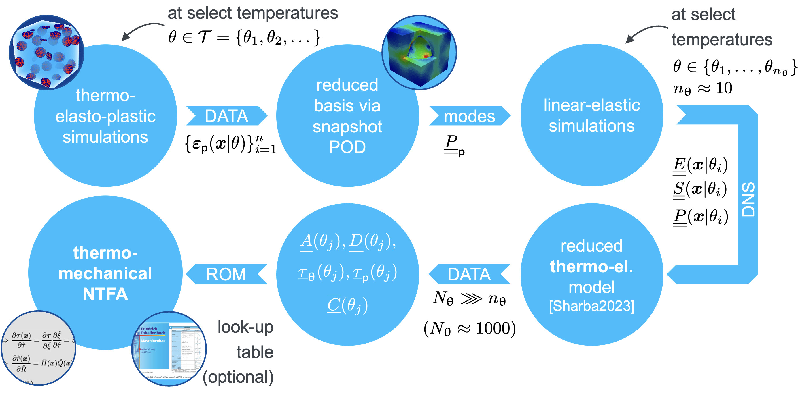

Welcome to ThermoNTFA's documentation!
======================================
.. role:: python(code)
   :language: python
   :class: highlight

-------------------------------------------------------
Thermo-Plastic Nonuniform Transformation Field Analysis
-------------------------------------------------------

TODO: abstract

Offline phase: Training of the thermo-mechanical NTFA
-----------------------------------------------------

1. Generate data using thermo-elasto-plastic simulations on the microscale at select temperatures :math:`\theta \in \mathcal{T}`.
For that, we used an in-house FE solver. However, any other suitable simulation software could be used.

2. Compute a reduced basis consisting of plastic modes :math:`\underline{\underline{P}}_{\mathsf{p}}` via snapshot POD of the simulated plastic strain fields :math:`\{\varepsilon_\mathsf{p}(x | \theta)\}^n_{i=1}`.
The corresponding implementation is available in our [AdaptiveThermoMechROM](https://github.com/DataAnalyticsEngineering/AdaptiveThermoMechROM) repository in the module [ntfa.py](https://github.com/DataAnalyticsEngineering/AdaptiveThermoMechROM/blob/ntfa/ntfa.py).

3. Perform additional linear-elastic simulations to determined self-equilibrated fields for the plastic modes :math:`\underline{\underline{P}}_\mathsf{p}` at select temperatures :math:`\theta \in \mathcal{T}`.
Again, we used our in-house FE solver for that.

4. Based on the generated data at select temperatures :math:`\theta \in \mathcal{T}` we perform an interpolation to arbitrarily many intermediate temperatures :math:`\theta_j`.
This method is published in our paper ["Reduced order homogenization of thermoelastic materials with strong temperature-dependence and comparison to a machine-learned model"](https://doi.org/10.1007/s00419-023-02411-6), where we show that it produces highly accurate results while the effort is almost on par with linear interpolation.

5. Using the interpolated data, the NTFA system matrices :math:`\underline{\underline{A}}(\theta_j)`, :math:`\underline{\underline{D}}(\theta_j)`, :math:`\bar{\underline{\underline{C}}}(\theta_j)`, :math:`\underline{\tau}_{\mathrm{\theta}}(\theta_j)`, and :math:`\underline{\tau}_{\mathsf{p}}(\theta_j)` are computed and stored as tabular data.
The corresponding implementation is available in our [AdaptiveThermoMechROM](https://github.com/DataAnalyticsEngineering/AdaptiveThermoMechROM) repository in the module [ntfa.py](https://github.com/DataAnalyticsEngineering/AdaptiveThermoMechROM/blob/ntfa/ntfa.py).

Online phase: Usage of the thermo-mechanical NTFA in simulations on the macroscale
----------------------------------------------------------------------------------

1. Load the tabular data for the NTFA matrices :math:`\underline{\underline{A}}(\theta_j)`, :math:`\underline{\underline{D}}(\theta_j)`, :math:`\bar{\underline{\underline{C}}}(\theta_j)`, :math:`\underline{\tau}_{\mathrm{\theta}}(\theta_j)`, and :math:`\underline{\tau}_{\mathsf{p}}(\theta_j)` that are generated in the offline phase based on direct numerical simulations on the microscale.
Optionally truncate the NTFA modes :math:`N_{\mathrm{modes}}` to be used.

2. Perform a linear interpolation to determine the NTFA matrices at the current model temperature based on the tabular data.
Given that the tabular data is available at sufficiently many temperatures, the linear interpolation provides results with decent accuracy.
This is done using the class [`thermontfa.TabularInterpolation`](https://github.com/DataAnalyticsEngineering/ThermoNTFA/blob/main/thermontfa/tabular_interpolation.py).

3. Use the tabular data to initialize the thermo-mechanical NTFA UMAT that is implemented in the class [`thermontfa.ThermoMechNTFA`](https://github.com/DataAnalyticsEngineering/ThermoNTFA/blob/main/thermontfa/thermoNTFA.py).
This reference implementation in Python can be transcribed to an UMAT for other academic or commercial simulation softwares.
The numerical experiments in our paper are conducted using an implementation of the thermo-mechanical NTFA UMAT in C++ for an in-house FE solver.

.. toctree::
   :maxdepth: 2
   :caption: Contents:

   Installation<installation>
   ThermoNTFA Documentation<api>
   Tutorial<tutorial_material/tutorial>
   Examples<examples>
   MarkdownLinks/license
   MarkdownLinks/citation
   MarkdownLinks/changelog

.. include:: copyright.rst
